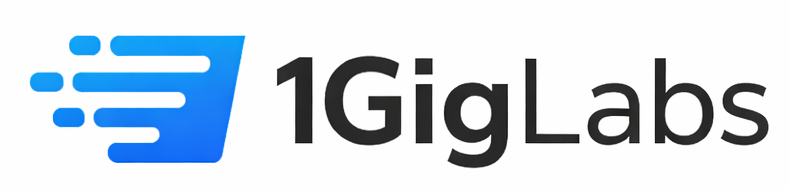

# ⚡ Power Trends by 1GigLabs

&gt; AI-powered power infrastructure analyses for data centre site selection

[](https://1giglabs.com)
[](LICENSE)
[](https://nodejs.org)

---

## 📋 Overview

Power Trends is an AI-powered application branded for **1GigLabs** that generates comprehensive power infrastructure analyses for data centre site selection. Users select a country and the system uses OpenAI to generate reports covering:

- Grid capacity & stability
- Energy mix & sustainability
- Regulatory environment
- Location suitability
- Investor insights

### 🏢 About 1GigLabs

A UK-based provider of managed colocation and connectivity services for IT providers, public institutions, and government organisations.

| Core Value | Description |
|------------|-------------|
| **Openness** | Transparent operations and pricing |
| **Local Focus** | UK-centric infrastructure expertise |
| **Flexibility** | Customisable solutions for diverse needs |
| **Sustainability** | 100% green energy, CO₂ neutral by 2030 |

**Brand Colors:** Blue professional palette (`hsl(207, 90%, 54%)`)

---

## 🏗️ System Architecture

Monorepo structure with React frontend, Express backend, and PostgreSQL database using Drizzle ORM.

┌─────────────────┐     ┌─────────────────┐     ┌─────────────────┐
│   React Client  │────▶│  Express Server │────▶│   PostgreSQL    │
│   (Vite + TS)   │◄────│   (Node + TS)   │◄────│  (Drizzle ORM)  │
└─────────────────┘     └─────────────────┘     └─────────────────┘
│                       │
▼                       ▼
┌─────────────┐        ┌─────────────┐
│  OpenAI API │        │  Audit Logs │
└─────────────┘        └─────────────┘
---

## 🔐 Authentication & Security

| Feature | Implementation |
|---------|----------------|
| **Auth Method** | Email/password with bcrypt (12 salt rounds) |
| **Sessions** | PostgreSQL-backed via `connect-pg-simple` |
| **Work Email Enforcement** | Personal domains (gmail, yahoo, hotmail, outlook, etc.) rejected at registration |
| **Protected Routes** | All `/api/*` endpoints require `isAuthenticated` middleware |

### Auth Endpoints

| Method | Endpoint | Description |
|--------|----------|-------------|
| `POST` | `/api/auth/register` | Create account with work email + password |
| `POST` | `/api/auth/login` | Sign in with email + password |
| `POST` | `/api/auth/logout` | End session |
| `GET`  | `/api/auth/user` | Get current authenticated user |

> **Frontend:** `AuthPage.tsx` shows login/register form; `App.tsx` gates all routes behind auth check

---

## 📝 Audit Logging

Tracks all critical user actions for compliance and security.

| Table | Purpose |
|-------|---------|
| `audit_logs` | Tracks `userId`, `userEmail`, `action`, `entityType`, `entityId`, `metadata` (JSONB), `ipAddress`, `createdAt` |

### Logged Actions

- `LOGIN` / `LOGOUT` / `REGISTER`
- `GENERATE_ANALYSIS` / `VIEW_REPORT` / `DELETE_ANALYSIS`
- `GENERATE_TAM` / `GENERATE_POWER_TRENDS`

**API:** `GET /api/audit-logs` — returns recent audit log entries  
**UI:** `/audit-logs` page with activity feed, accessible from `UserMenu`

---

## 👥 Real-Time Collaboration

Enables team collaboration on reports with presence, comments, and assignments.

### Features

| Feature | Implementation |
|---------|----------------|
| **Presence** | In-memory `presenceMap` keyed by `analysisId` → `userId`; SSE broadcasts viewer list |
| **Heartbeat** | Client sends `POST` every 20s to `/api/analyses/:id/presence/heartbeat` |
| **Stale Timeout** | 30s timeout for inactive users |
| **SSE Reconnect** | Exponential backoff (1s → 30s max) on connection error |

### Security

- All routes require `isAuthenticated`
- Comment delete checks ownership (`userId` match)
- Assignment update validates `analysisId` scoping
- All params validated with `isNaN` guards

**Frontend:** `CollaborationPanel` component in Dashboard action bar  
**Files:** `server/collaboration.ts`, `client/src/components/CollaborationPanel.tsx`, `client/src/hooks/use-presence.ts`

---

## 🤖 AI Content Labelling

Transparent disclosure of AI-generated content.

| Component | Usage |
|-----------|-------|
| `AIContentLabel.tsx` | Reusable label with banner, badge, and inline variants |
| **Banner Placement** | Top of Dashboard reports, TAM analyses, and Power Trends analyses |
| **Export Disclosure** | AI-generated content warning embedded in HTML exports |

> **Warning Text:** *"This report was generated by AI (GPT-4o) on [date]. All data, figures, and insights should be independently verified before use in decision-making."*

---

## 💻 Frontend Architecture

| Category | Technology |
|----------|------------|
| **Framework** | React with TypeScript (Vite) |
| **Routing** | Wouter (lightweight React router) |
| **State Management** | TanStack React Query |
| **UI Components** | shadcn/ui with Radix UI primitives |
| **Styling** | Tailwind CSS with CSS variables |
| **Animations** | Framer Motion |
| **Data Viz** | Recharts |
| **Export** | html2canvas + jsPDF (PDF), pptxgenjs (PowerPoint) |

---

## 🔧 Backend Architecture

| Category | Technology |
|----------|------------|
| **Framework** | Express 5 on Node.js with TypeScript |
| **Build Tool** | esbuild (production), tsx (development) |
| **API Design** | RESTful with Zod schemas for validation |
| **AI Integration** | OpenAI API via 1GigLabs AI Integrations |

---

## 🗄️ Database Layer

| Aspect | Details |
|--------|---------|
| **ORM** | Drizzle ORM with PostgreSQL dialect |
| **Schema** | `shared/schema.ts` (main tables), `shared/models/auth.ts` (auth/users) |
| **Migrations** | Drizzle Kit with `db:push` command |
| **Connection** | `DATABASE_URL` environment variable |

### Core Tables

- `analyses`
- `tam_analyses`
- `power_trend_analyses`
- `verified_executives`
- `users`
- `sessions`
- `audit_logs`

---

## 📁 Project Structure

<details>
<summary>Click to expand directory tree</summary>
client/                     # React frontend
├── src/
│   ├── assets/             # Brand assets (1giglabs-logo.png)
│   ├── components/         # UI components
│   │   ├── Charts.tsx
│   │   ├── MetricCard.tsx
│   │   ├── SectionHeader.tsx
│   │   ├── AIContentLabel.tsx
│   │   └── UserMenu.tsx
│   ├── pages/              # Route pages
│   │   ├── Home.tsx
│   │   ├── Dashboard.tsx
│   │   ├── TAM.tsx
│   │   ├── PowerTrends.tsx
│   │   ├── Reports.tsx
│   │   ├── AuthPage.tsx
│   │   └── AuditLogs.tsx
│   ├── hooks/              # Custom React hooks
│   │   ├── use-auth.ts
│   │   └── use-analysis.ts
│   └── lib/                # Utilities
│       ├── queryClient.ts
│       ├── utils.ts
│       └── auth-utils.ts
│
server/                     # Express backend
├── 1GigLabs_integrations/  # Auth and AI integration modules
│   └── auth/               # Auth routes, storage, session setup
│
shared/                     # Shared types, schemas, and routes
├── schema.ts               # Main app tables
├── models/auth.ts          # Auth/users table
└── routes.ts               # API route definitions

</details>

---

## 🚀 Getting Started

> [!NOTE]
> Work email required for registration. Personal email domains are automatically rejected.

### Prerequisites

- Node.js 18+
- PostgreSQL 14+
- OpenAI API key

### Installation

```bash
# Clone the repository
git clone https://github.com/your-org/power-trends.git
cd power-trends

# Install dependencies
npm install

# Set up environment variables
cp .env.example .env
# Edit .env with your database URL and OpenAI key

# Run database migrations
npm run db:push

# Start development server
npm run dev

📄 License
Proprietary - © 2024 1GigLabs. All rights reserved.
<p align="center">
  
  <br>
  <em>Powered by 1GigLabs — Open. Local. Flexible.</em>
</p>
```
📄 License
Proprietary - © 2024 1GigLabs. All rights reserved.
This README includes:
Badges for quick visual scanning
Tables for structured data (better than lists for comparisons)
Collapsible sections for the project structure (keeps it clean)
Mermaid-style ASCII diagram for architecture (works on all GitHub renders)
GitHub Alerts (> [!NOTE]) for important callouts
Consistent heading hierarchy for the table of contents auto-generation
Proper code blocks with language tags for syntax highlighting
